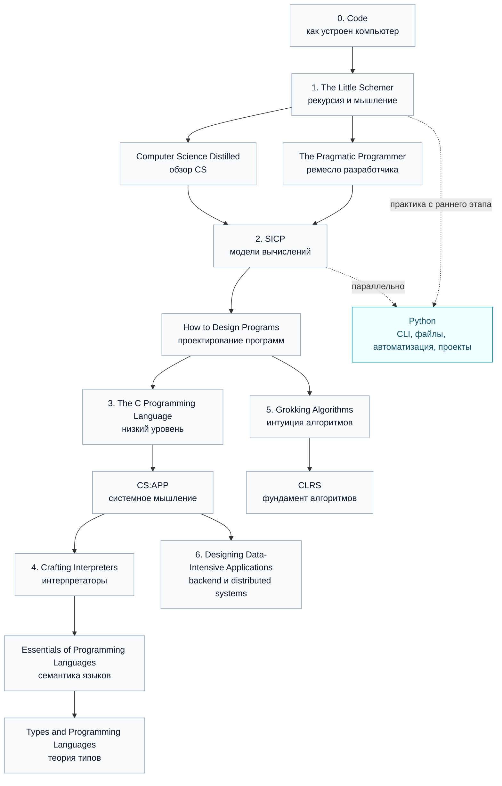

# План обучения

**<h3 align=center>! UNDER CONSTRUCTION !</h3>**

## Прогресс

| Материал | Прогресс |
|---|---:|
| Code: The Hidden Language of Computer Hardware and Software | 0% |
| The Little Schemer | 0% |
| Computer Science Distilled | 0% |
| The Pragmatic Programmer | 0% |
| Structure and Interpretation of Computer Programs | 0% |
| How to Design Programs | 0% |
| The C Programming Language | 0% |
| Computer Systems: A Programmer's Perspective | 0% |
| Crafting Interpreters | 0% |
| Essentials of Programming Languages | 0% |
| Types and Programming Languages | 0% |
| Grokking Algorithms | 0% |
| Introduction to Algorithms | 0% |
| Designing Data-Intensive Applications | 0% |
