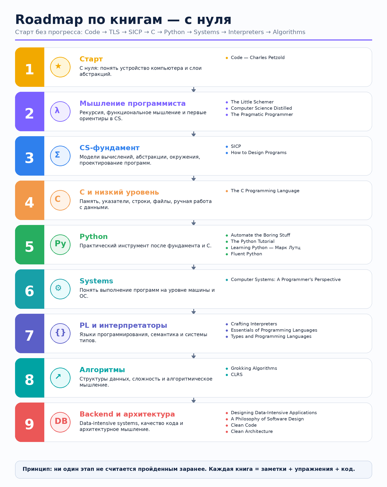
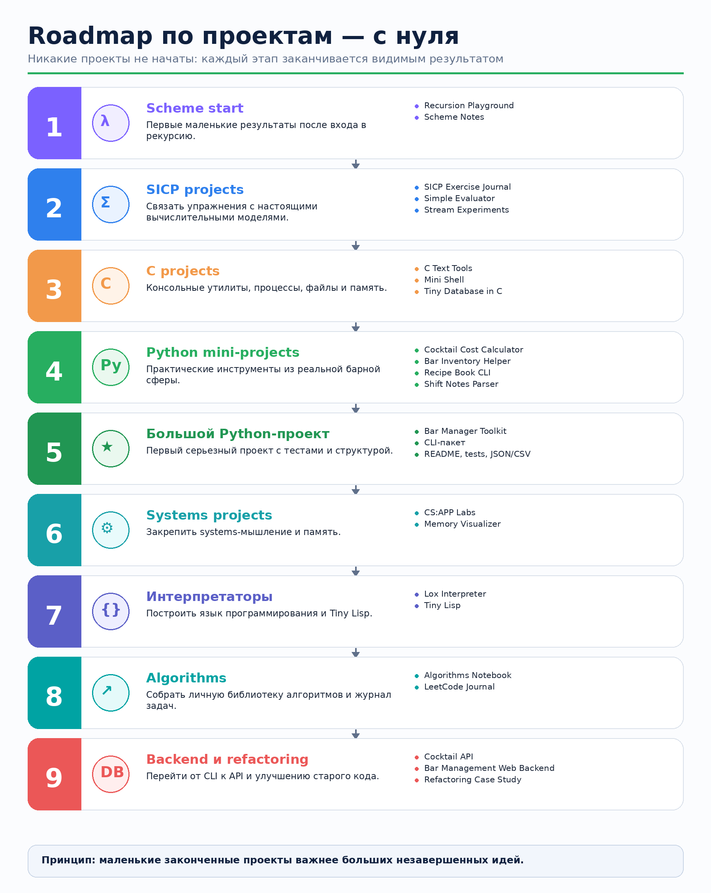
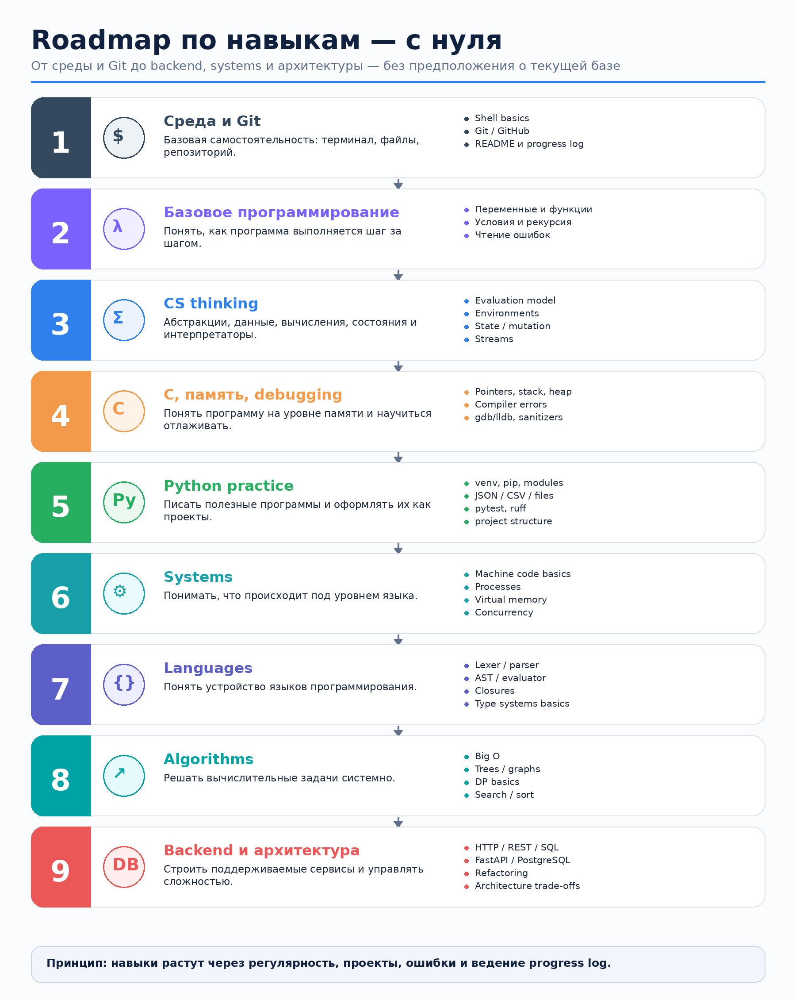

# LEARN_DB

Личный репозиторий для последовательного изучения программирования и Computer Science с нуля.

Маршрут разделен на три связанные линии:

- **книги** - что изучать и в каком порядке;
- **проекты** - чем подтверждать понимание;
- **навыки** - какие инженерные привычки и умения должны вырасти.

## Визуальная карта

### Книги



### Проекты



### Навыки



## Стартовое состояние

| Направление | Всего | Готово | Прогресс |
|---|---:|---:|---:|
| Книги | 21 | 0 | 0% |
| Проекты | 22 | 0 | 0% |
| Блоки навыков | 18 | 0 | 0% |

## Основной порядок

```text
-> Code: The Hidden Language of Computer Hardware and Software
-> The Little Schemer
-> Computer Science Distilled + The Pragmatic Programmer
-> SICP + How to Design Programs
-> C
-> Python
-> Systems
-> Interpreters
-> Algorithms
-> Backend
-> Architecture
```

## Файлы

- [`ROADMAP.MD`](ROADMAP.MD) - полная дорожная карта по книгам, проектам и навыкам.
- [`DIARY.md`](DIARY.md) - дневник обучения с чистого листа.
- [`assets/roadmaps`](assets/roadmaps) - визуальные карты.
- [`archive/legacy`](archive/legacy) - старые файлы до сброса прогресса.
